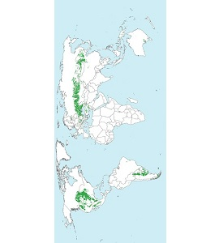

# Soil Taxonomy App
# 
App for learning Soil Taxonomy. Developed by members of the Facultad de Agronomía y Veterinaria - Universidad Nacional de Río Cuarto (Argentina)

Repo in construction

Published versions in Playstore: 
English version: https://play.google.com/store/apps/details?id=ar.edu.unrc.soiltaxonomy  
Spanish version: https://play.google.com/store/apps/details?id=ar.edu.unrc.taxonomiasuelos  

Web version (updated - beta): https://taxosuelos.github.io/index.html

 
 
         

	

    <!---Esto no sé si va a traer problemas en algunas pantallas, sino cargar imagen triple.jpg con ancho auto--->
	

	

    
&nbsp;

	

	

    
	

	

    
&nbsp;

	

	

    
	

	
 
 
